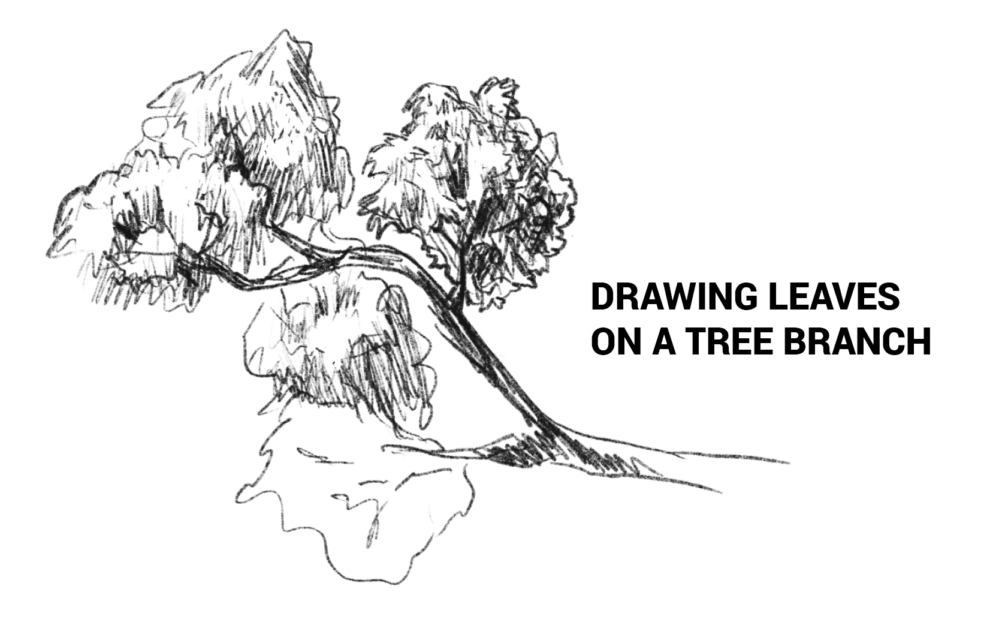
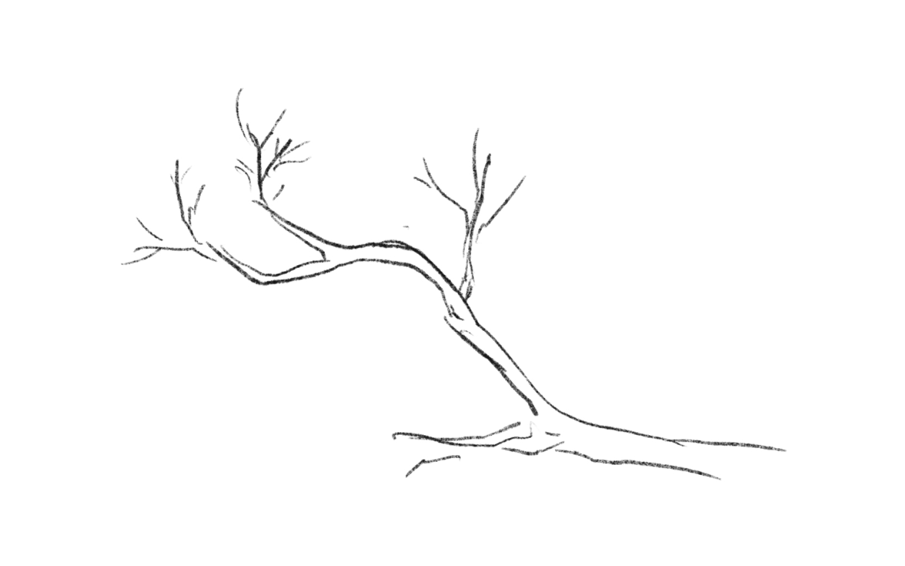
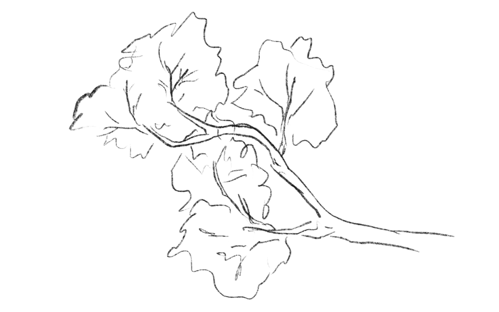
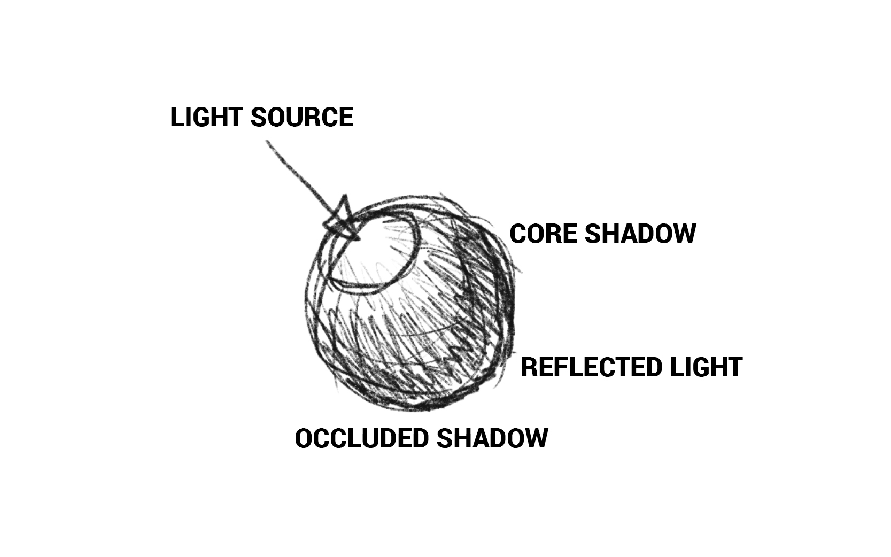
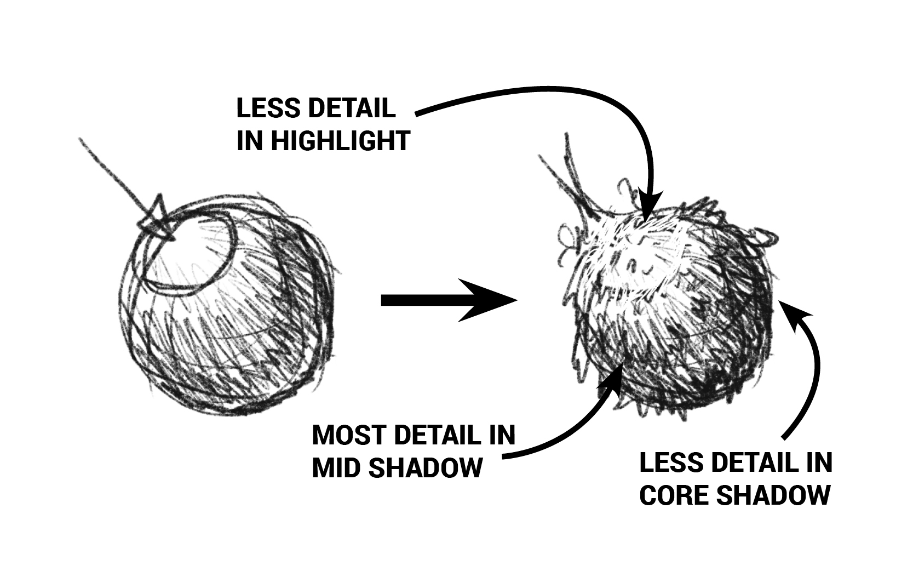
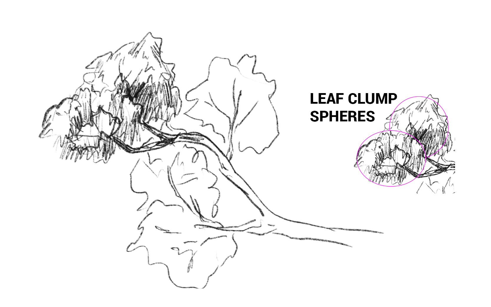
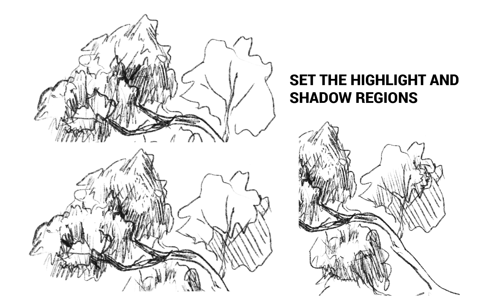
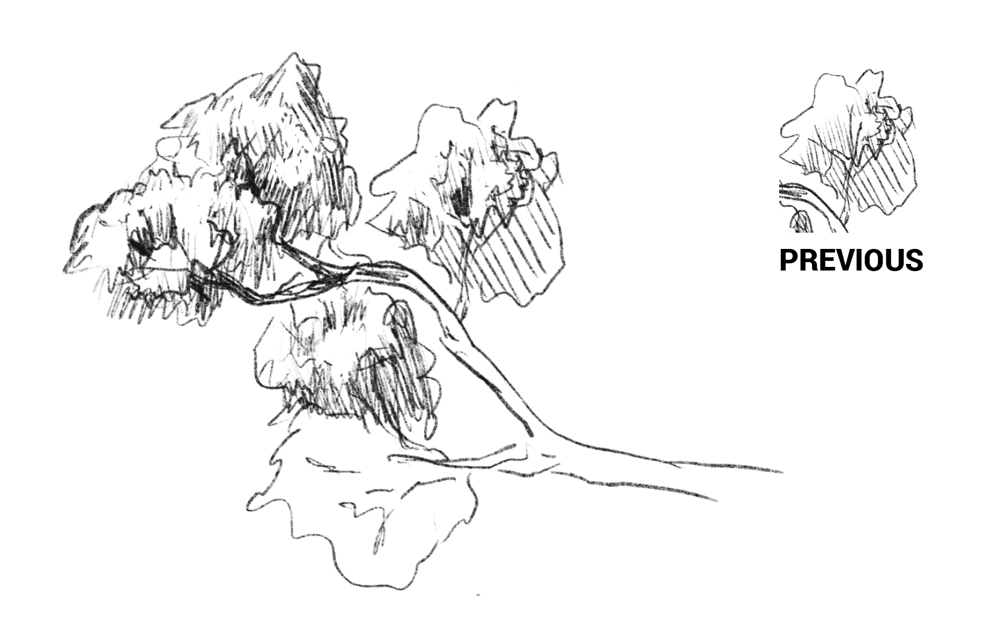
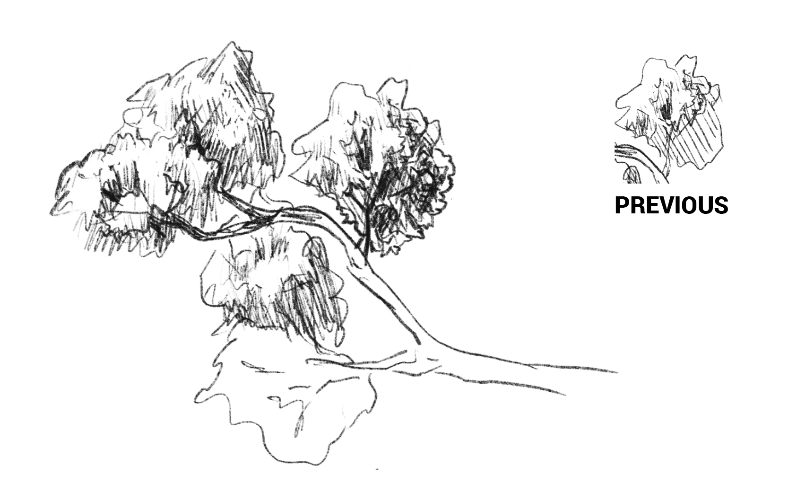
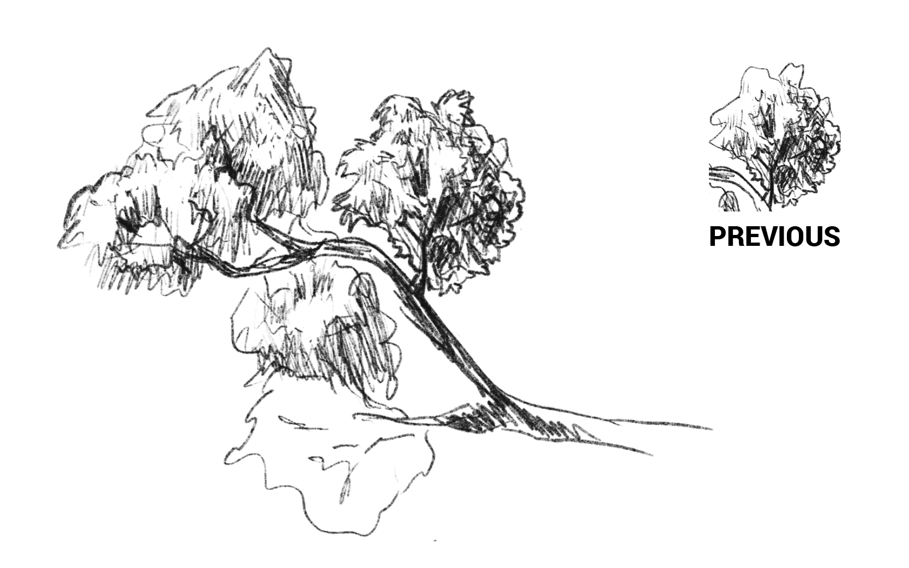

## How do I draw tree leaves?

Why is it that every tree tutorial starts simple--draw the shape of the tree, draw the shape that the leaf clumps make-- but then immediately goes from a basic construction to a finished detailed drawing? Some tutorials I've found out there don't even look like their tree's have leaves! Drawing leaves on a tree is difficult. A large reason is because the approach you need to take to draw leaves changes drastically from a close-up view to a far away view. Also, leaves are extremely repetitive and there are *a lot* of leaves on trees. To draw every leaf would be maddening, yet to not can often leave a drawing feeling like there was a very big detail missing.

So how do I draw leaves? I've worked quite a while at this subject and I've come to a conclusion: You should paint them! It's way easier as you can do large areas at a time and the texture of a paintbrush lets you make a lot of leaf-looking shapes very easily. Unfortunately, we don't always have paint lying around. Because of this I continued to search for a way to draw somewhat realistic tree leaves without losing my mind. Above is the sketch I'll be walking you through so you will have an understanding of how to draw clumps of leaves at a mid-distance. I will try to illustrate the change between the **construction of the drawing** and the **detailing of the drawing** so you are able to follow the tutorial fully.

## Draw the shape of a tree&mdash;construction of the drawing

To start, I have a simple tree branch from the side. Note how the branches diverge, they split in twos but not all at once. The branches get slightly thicker where they split and they overlap slightly because they are 3D shapes on a 2D canvas. Feel free to use a reference of a tree branch if you are new. Here is a good example of a solid reference for just the branch: [tree branch reference example](https://encrypted-tbn0.gstatic.com/images?q=tbn%3AANd9GcS2VI6o85F_fKla30jO-DTZq5Zk7Z1_OwWwmB1CdJ23CTrPC3SM)

Moving forward, I usually block in the shape that the leaves will be making. I keep this loose and light as it is just a reference for where my clumps of leaves will be. It also serves as a reference to the *other* side of the leaves on the tree, hence the branches laying on top of this. So far, we haven't done much any other tree leaf drawing tutorial has done. We are still in the *construction phase* of the drawing, where we set up the 3D shapes we are going to detail as we go through the drawing.

## Brief tips on detailing tree leaves

Tree leaf clumps are really just lump spheres. To illustrate this, I drew up a typical sphere. It has a highlight from a lightsource, a shadowed area with a core shadow, an area of reflected light, and an area of occlusion where very little light reaches. The start of a construction-phase sketch does not have to be pretty, as long as you are able to mark the areas you will be drawing in the **detailing of the drawing**.

To detail this 3D object, I drew leaf-shaped outlines and spaced them along where the sphere's surface changes angles. These let you shade the clump predominately in a step-by-step fashion. Note how there are more detailed leaf shapes in the mid-liht areas of the sphere. ***The highlights and core shadows are harder to see leaf shapes in***. This applies to any texture a surface has. It is easiest to see the texture of a surface where the angle of the surface turns from light to shadow.

## Finishing construction of tree leaf clumps

With the above tips in mind, we will start to construct the leaf clumps as a 3D shape, keeping in mind they tend to lay in a spherical shape. I put in a shadow and a highlight. I also make sure to put where the leaves will block the view of the tree branches. We can see the tree branches in the shadow area (as that is usually the shadow side of the leaves on the opposite side of the tree). The sphere shapes are shown on the side. We have finished the basic construction of these tree leaf clumps!

From here, all that's left for a sketch is to just add some details. If you were doing a finished drawing, you would probably want to start detailing out the leaves more cleanly, at least in the foreground of the clump. You could add some light details on the leaves where they are not fully in light or shadow. Lets look into going from construction to adding a bit of light detail on the other clumps of leaves in this tree.

## Guided tree leaf drawing and detailing

The first step you probably already know. we are going to set the highlight and shadow regions. Remember, this clump is spherical.

I decided to add in a bit of a break in the tree leaves for this clump of leaves. I also started marking some edges where the leaves from that layer will end. Remember back to the sphere of leaves&mdash;the leaves will lay in layers on top of themselves. This is due to gravity flopping them down on top of eachother. Some of them are able to stick up a bit though, and we can see that on the right side. 

For this step I darkened up the shadows. I am pushing the lights and darks quite ahrd in this sketch as the tree is completely isolated. In an illustration I might not push the highlights or shadows so hard depending on whats around it in the rest of the illustration. For a sketch, it's a great way to explore the full range of tones for the different angles of the subject.

If you look closely, there are pockets of dark shadows. This is where there is a gap in the leaves in mid-shadow and reflected light (remember the sphere). You can more clearly see the leaf details in the mid-shadow than the full shadow. Also note that on the edge there is light from the other side brightening up the edge. In a real environment this would likely be predominately from sky light (or light reflected from the particles of air in the sky).

This step might seem familiar. We are at the "end" of the drawing&mdash;or the sketch that is. This is the step where a lot of people can get lost, so I will try to explain the steps I took the best I can. Nothing has changed in the construction of the drawing. We are very much in the **detailing of the drawing** at this step.

Do you see that arrow? Of course you do it's gigantic! It is pointing to the outer edge of the clump. I took the construction of the clump we did from our previous steps, erased away the line, and then added a more detailed shape of a layer of leaves to the outside. I laid them in layers with gravity pulling them downward slightly. I made sure *not to add any details to the leaves in the highlight*. I mearly drew the outer line of the layer of leaves to denote where the surface changes. This will get you most of the way there for a drawing of tree leaves.

If I were to draw this further, I would try to make my shading more uniform. I would also try to mbe more explicit with my leaf shapes. You can go as far as drawing every leaf, or stop somewhat short&mdash;but still explicitly drawing full leaf shapes in the foreground to lead the eye to believing the more abstracted texture behind it is indeed leaves.

And that is it for this walkthrough. I hope this helps bridge the gap between the construction phase and detailing phase of the drawing. From this phase, there are multiple ways to continue on with the drawing or using it as a workup for another more detailed drawing in the future.